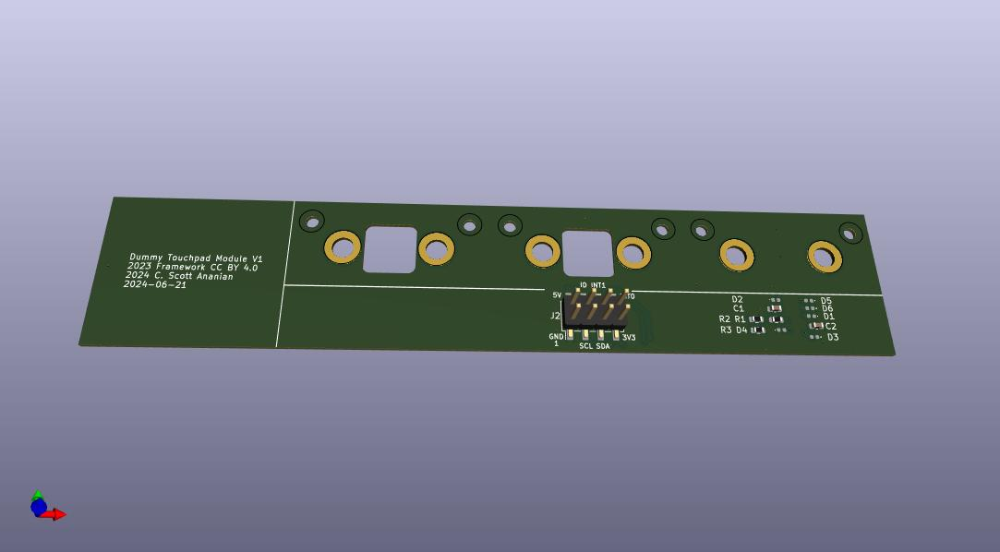

# Dummy Touchpad Input Module

This is a dummy touchpad.  All it does is contain the resistors and pads to
tell the FW16 that there is a touchpad installed (though there is not).
It also brings the signal lines out to a 2.54mm SMT header, but that's
mostly for debugging/development, not for any real use.

Here's the [schematic](./MinimalSmallInputModule.pdf).

## License
Input Modules © 2023 by Framework Computer Inc is licensed under CC BY 4.0. To view a copy of this license, visit http://creativecommons.org/licenses/by/4.0/

## Fabrication and Assembly
Use a 0.8mm PCB for Input Modules.
